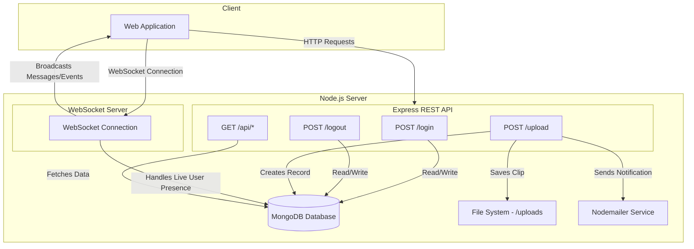

```text
 __   __  ____  ____  _  _  ____  ____ 
(  ) (  )(  _ \(  _ \( \/ )( ___)(_  _)
 )(__  )(  ) _ < )   / \  /  )__)   )(  
(____)(__)(____/(__\_)  \/  (____) (__) 
```

# VoiceNet
### Real-time Voice & Text Communication Platform

VoiceNet is a lightweight, real-time communication server built with Node.js, Express, and WebSockets. It provides a foundation for applications requiring instant text messaging, voice clip sharing, user presence tracking, and email notifications.

---


---

## 📑 Table of Contents
*   [🏛️ Architecture Overview](#️-architecture-overview)
*   [🎯 Key Features](#-key-features)
*   [🗂️ Project Structure](#️-project-structure)
*   [🚀 Getting Started](#-getting-started)
*   [🔌 API Reference](#-api-reference)
*   [🔧 Environment Variables](#-environment-variables)

---

## 🏛️ Architecture Overview

VoiceNet uses a hybrid communication model. A standard **Express.js REST API** handles stateless operations like user authentication and file uploads. Concurrently, a **WebSocket server** manages stateful, real-time connections for instant message broadcasting, presence updates, and live notifications.

Audio clips are uploaded via a REST endpoint, saved to the server's file system, and then the URL is broadcast to all connected clients through the WebSocket connection.



---

## 🎯 Key Features

| Feature | Description |
| :--- | :--- |
| **Real-Time Chat** | Broadcasts text messages and audio clip URLs instantly to all connected clients using WebSockets. |
| **User Authentication** | Simple register number and password-based login system. Includes an auto-seeding script for initial user setup. |
| **Active User Presence** | Tracks currently logged-in users in real-time. The `lastSeen` status is updated on login, logout, and WebSocket activity. |
| **Audio Clip Uploads** | Allows users to upload audio files (e.g., `.ogg`) which are stored on the server and made available via a public URL. |
| **Email Notifications** | Integrated with Nodemailer to send emails for key events like user logout and new content uploads. |
| **Admin API** | Provides REST endpoints to fetch all user details, see currently active users, and manage uploaded voice clips. |

---

## 🗂️ Project Structure

```text
voicenet/
├── public/                 # Static frontend files (HTML, CSS, JS)
│   └── login.html
├── uploads/                # Directory for storing uploaded audio clips
├── .env                    # Environment variables (see below)
├── package.json
└── server.js               # Main application entrypoint (Express, WebSocket, DB logic)
```

---

## 🚀 Getting Started

### Prerequisites
- Node.js (v16 or higher)
- MongoDB

### Steps
1.  Clone the repository:
    ```bash
    git clone <repository-url>
    cd voicenet
    ```
2.  Install dependencies:
    ```bash
    npm install
    ```
3.  Create a `.env` file in the root directory and populate it with the necessary environment variables. You can use `.env.example` as a template.
    ```bash
    cp .env.example .env
    # Edit .env with your configuration
    ```
4.  Ensure your MongoDB server is running.

5.  Start the server:
    ```bash
    node server.js
    ```

The server will be running at `http://localhost:3000` (or the port specified in your `.env` file).

---

## 🔌 API Reference

### Authentication
*   `POST /login`
    *   Authenticates a user.
    *   **Body**: `{ "registerNumber": "...", "password": "...", "gmail": "..." }`
    *   **Response**: `{ "success": true, "message": "Login successful" }`

*   `POST /logout`
    *   Logs a user out and updates their `lastSeen` status.
    *   **Body**: `{ "registerNumber": "..." }`
    *   **Response**: `{ "success": true, "message": "Logout successful" }`

### File Upload
*   `POST /upload`
    *   Uploads a single audio file. Expects `multipart/form-data`.
    *   **Form Fields**: `file` (the audio file), `clientId` (the user's register number).
    *   **Response**: `{ "ok": true, "filename": "...", "url": "/uploads/..." }`

### Admin & Data Retrieval
*   `GET /api/user-details`
    *   Retrieves a list of all registered users.
    *   **Response**: `[{ "registerNumber": "...", "email": "...", "lastSeen": "..." }]`

*   `GET /api/active-users`
    *   Retrieves a list of users currently marked as active.
    *   **Response**: `[{ "registerNumber": "..." }]`

*   `GET /api/user-clips`
    *   Retrieves a list of all uploaded clips.
    *   **Response**: `[{ "registerNumber": "...", "filename": "...", "timestamp": "..." }]`

### Clip Management
*   `DELETE /api/user-clips/:filename`
    *   Deletes a single clip by its filename.
    *   **Response**: `{ "success": true }`

*   `DELETE /api/user-clips/user/:registerNumber`
    *   Deletes all clips associated with a specific user.
    *   **Response**: `{ "success": true, "deletedCount": 3 }`

---

## 🔧 Environment Variables

Create a `.env` file in the project root with the following variables:

```env
# Server Configuration
PORT=3000
MONGO_URI=mongodb://127.0.0.1:27017/voicenet

# Email Configuration (for Nodemailer)
EMAIL_HOST=smtp.example.com
EMAIL_PORT=587
EMAIL_SECURE=false
EMAIL_USER=user@example.com
EMAIL_PASS=your-email-password
```